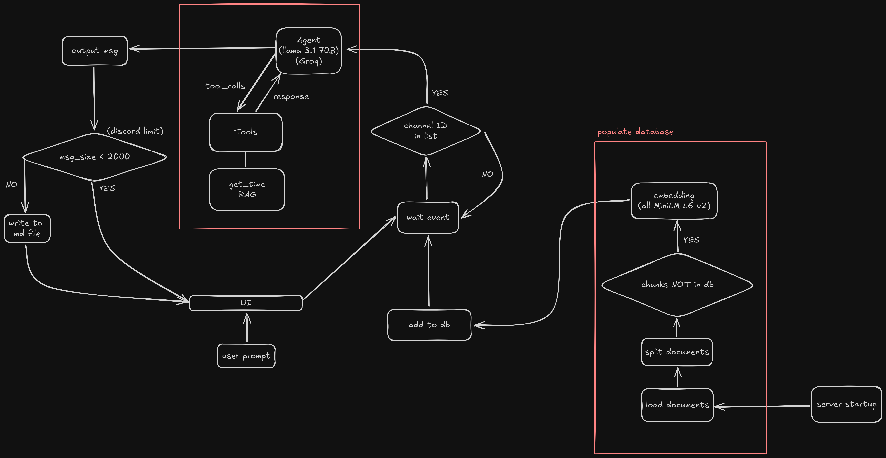

# Discord_AIBOT
My first discord bot created by myself.

## Workflow


## Create environment
```
python -m venv venv
```

## Activate venv
```
venv\Scripts\Activate.ps1
```

## Install dependency
```
pip install -r requirements.txt
```

## Run the bot
```
python bot.py
```